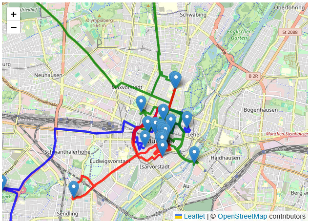

# 🗺️ CityTour Planner

A **Streamlit** + **FastAPI** demo that plans one‑day city tours, visualizes the sights on an interactive map, and generates postcard‑style narrations with an LLM.



CityTour Planner helps you craft personalized one-day city tours with AI-generated narrations — all accessible via web UI, API, or CLI.

The project contains:

| Component                                  | Purpose                                                      | Port   |
| ------------------------------------------ | ------------------------------------------------------------ | ------ |
| **Streamlit app** (`app/streamlit_app.py`) | Friendly UI to choose a city, filter sights, and render the plan on a Leaflet map. | `8501` |
| **FastAPI service** (`app/api.py`)         | JSON API for tour generation (`/plan`) and narration (`/narrate`). | `8000` |
| **Planner core** (`planner/…`)             | Re‑usable planning logic (routing, weather handling, narration, etc.). | –      |

The whole stack is packaged in a single Docker image for simple, reproducible deployment on any laptop, server, or cloud platform.

---

## ✨ CLI Narration Example

Generate a narrated plan directly from the command line:

```bash
$ python tourist_planner.py --city "Berlin" --plan
🗓️ Morning:
The city wakes up — golden light reflects off the riverbank as ...

```

---

## 🧠 LLM Narration Modes

| Mode           | Where                    | Runtime | Notes                                                        |
| :------------- | ------------------------ | ------- | ------------------------------------------------------------ |
| Template       | Streamlit & FastAPI      | Instant | Default mode. Works without any API keys.                    |
| Gemma-2B / GPT | `tourist_planner.py` CLI | CPU/GPU | Full LLM narration pipeline (prompting, post-processing). Switch by setting `USE_TEMPLATE=false` or using `--llm` in the CLI. |

---

## 🚀 Quick Start (Docker)

> **Prerequisites:** Docker 24+ (Docker Desktop on macOS/Windows or `docker` + `podman` on Linux).

```bash
# 1 – Clone the repo
$ git clone https://github.com/<your‑org>/citytour‑planner.git
$ cd citytour‑planner

# 2 – Build the image (tag it `citytour-planner`)
$ docker build -t citytour-planner .

# 3 – Run the container, exposing Streamlit (8501) & FastAPI (8000)
$ docker run -p 8501:8501 -p 8000:8000 citytour-planner

# 4 – Open your browser
Streamlit UI  →  http://localhost:8501
OpenAPI docs →  http://localhost:8000/docs
```

---

## 📂 Project Structure

```
├── app/
│   ├── api.py            # FastAPI service
│   ├── streamlit_app.py  # Streamlit UI entrypoint
│   └── ui.py             # Streamlit helper widgets
├── planner/              # Core planning library
│   ├── base_planner.py
│   ├── data_loader.py
│   ├── weather.py
│   └── ...
├── data/
│   └── sights.csv        # Sample POI data
├── requirements.txt
└── Dockerfile            # Provided below
```

---

## 🔌 API Reference

### `POST /plan`

Creates a full‑day tour plan.

```jsonc
{
  "city": "Berlin, Germany",
  "categories": ["museum", "park"],
  "mode": "walking" // walking | cycling | driving
}
```

**Response** – mapping of day‑slots to sights:

```jsonc
{
  "morning": [{"name":"Museum B","lat":52.52,"lon":13.41}],
  "afternoon": [...],
  "evening": [...]
}
```

### `POST /narrate`

Generates postcard‑style narration for one slot.

```jsonc
{
  "slot": "morning",
  "city": "Berlin, Germany",
  "sights": ["Museum B","Park A"]
}
```

**Response**

```jsonc
{"text": "The city wakes up — golden light ..."}
```

Interactive docs are auto‑generated at http://localhost:8000/docs (Swagger UI).

---

## 🛠️ Local Development (without Docker)

```bash
# Create & activate a venv
python -m venv .venv && source .venv/bin/activate

# Install deps (Graphviz needed for diagrams)
sudo apt-get install graphviz gcc
pip install -r requirements.txt

# Launch both services
streamlit run app/streamlit_app.py &
uvicorn app.api:app --reload --port 8000 --host 0.0.0.0
```

> **Tip:** Use `pre‑commit` hooks or `ruff` for linting (optional dev extras in `requirements-dev.txt`).

---

## 📦 Dockerfile (for reference)

```dockerfile
FROM python:3.11-slim
RUN apt-get update && apt-get install -y git gcc graphviz && rm -rf /var/lib/apt/lists/*
WORKDIR /app
COPY requirements.txt .
RUN pip install --no-cache-dir -r requirements.txt
COPY . .
ENV PYTHONPATH=/app
EXPOSE 8501 8000
CMD ["bash", "-c", "streamlit run app/streamlit_app.py --server.runOnSave false & uvicorn app.api:app --port 8000 --host 0.0.0.0"]
```

To download this README as a `.md` file:

```bash
# Save the README locally
curl -O https://raw.githubusercontent.com/<your-org>/citytour-planner/main/README.md
```

Or copy-paste the content and save it manually using any text editor.

---

## 🌍 Deploying to the Cloud

Because the image is fully self‑contained, you can push it to **Docker Hub**, **GitHub Container Registry**, or any registry and run it on:

* **Render / Fly.io** (simple docker‑deploy)
* **AWS Fargate / Google Cloud Run** (serverless containers)
* **Kubernetes** (e.g., GKE, EKS) — just create a Deployment + Service.

---

## 📜 License

This project is released under the **MIT License** — see [`LICENSE`](LICENSE) for details.